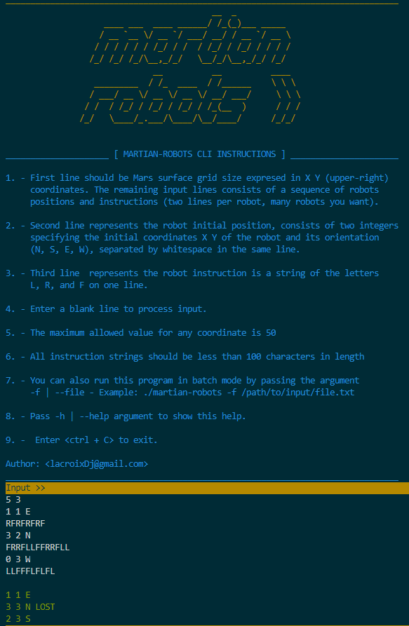

# MARTIAN - ROBOTS! 



This README.md file shows step by step how to install and run **martian-robots** CLI app.

## Stack:

- Node.js
- Docker

## Requirements:

There are two (2) different methods to install and run this app:

  1. ### **Docker way:** using Docker and building the Dockerfile image.
  2. ### **Localhost way:** install in your local machine, first you should to install and set-up the stack on your host 

## Cloning the repository from Github:

```
# git https://github.com/lacroixDj/martian-robots.git
# cd martian-robots/
```

## Instalation method #1  - Docker way: 

### Server requirements for method 1 (docker way):

You should have installed

- Docker >= 19.03.12

### Build & Run docker container

If you have already the docker environment installed and running, and also you have cloned the repo, run the following commands inside the project folder:

### Docker Option 1: ./build.sh

To make the things easier, a **build.sh** bash script has been included in the code.
You only have to run it as a user with enough privileges, and this script will make the hard work for you.

```
# sudo chmod +x ./build.sh
# sudo ./build.sh 
```

You should start to see messages like this:

```
--> Building the container image: docker build -t lacroixdj/martian-robots:latest .

--> Running the container in interactive mode:  docker run -it --name martian-robots lacroixdj/martian-robots:latest 
```
**Note:** If you start to see some errors during the process but finally the image is built and the container is running, just ignore them. That's because in order to rebuild an re-create a new container  the build.sh script tries to delete any previously created image / container, but if it doesn't exist then docker will throw an error message. This is not serious and won't break the build process.

Ok, just wait until the build process get completed.
Once the image build has been completed, the containers will run in interactive (-it) mode.

So if everything is OK, at the end you should see an output similar to the top banner image in this repo.

For using the app just follow the instructions in the welcome message. If you want to quit press <ctrl + C>.

**Note:** Quiting inside the runnig container will be stop the container. See more below about how to re-start and keep using your recent built container whenever you want.

### Docker Option 2: Building and running the container manually:

Maybe you want to run the commands by yourself, just follow this steps:

First you need to build the Node.js container image described in the Dockerfile (including the trailing dot)

```
> docker build -t lacroixdj/martian-robots:1.0 -t lacroixdj/martian-robots:latest .
```

Once the image has been built, lets run our new container:

```
> docker run -it --name martian-robots lacroixdj/martian-robots:latest
```

if everything went well so far, you should see an output similar to the top banner image in this repo!  

### Re-running your container after exiting / quiting 

It's normal for docker to stop running containers when the main process is closed or killed. Luckily, we can restart our container in a simple way as many times as we want

First lets restart our container:

```
> sudo docker start martian-robots
```

Then lets run our app inside the container:

```
> sudo docker exec -it martian-robots npm start
```
Lovely.

## Instalation method #2  - Localhost way: 

### Server requirements for method 2 (directly in your host):

You should have installed:

- Node.js ^12.xx.xx (LTS version)
- npm ^6.xx.xx (LTS version including with node)

Now we need to install  the app dependecies using **npm install**:

```
# cd martian-robots/
# npm install 
```

Ok, just wait until the node packages install is completed. Once npm install has been completed lets run in interactive (-it) mode.

```
# npm start 
```

If everything is OK, at the end you should see an output similar to the top banner image in this repo.

# Using the app:

**martian-robots** is a command line interface (CLI) application and can be run in two ways:

1. **Interactive mode:** you can run the application by calling any of the following **(without passing arguments)**:
- ./martian-robots
- npm start
- node martian-robots


The program will validate if the input commands comply with the proper format, otherwise the application will return an error message.


2. **Batch file mode:** This way allows us to place all the entries we want in a file and read the instructions in batch mode from it. It allows to process several robots in batch without the need to enter the commands one by one as in interactive mode:
- ./martian-robots -f ./test/data/1-sample.input.txt
- ./martian-robots --file ./test/data/2-sample.input.txt
- node martian-robots -f ./test/data/3-sample.input.txt

In addition to validating each command line of the file, similar as the previous method. It is also responsible for validating the existence of the file, if you have permissions to read it and also validates if file mimetype is equal text / plain (only plain text files are supported)

3. **showing the help and instructions**: Showing the help / instructions of the application. It is achieved by passing -h | --help when we invoke the app:
- ./martian-robots -h
- ./martian-robots --help 

# Testing

If you want to add more tests cases, just put files in ./test/data/ with the following format:

Test are excuted in batch mode using the option -f | --file passing entire inputs described in input.txt files.

<name>.input.txt: This file will be the input.
<name>.output.txt: This file will represent the according output for the input file of the same name.
  
The resulting (returned) output will be validated against the .output.txt files (just be sure both files keep the same prefix name).

## Running tests with the container mode  

If you want to run the tests inside the container, you just have to make sure the container is alive and running, the run the following:

```
> sudo docker exec -it martian-robots npm test
```

## Running tests in locahost mode  

You just have to run (inside the app  directory)
```
> npm test
```

## Tests output

If everything went well then you should see a message very similar to this 
```
  ✓ All robots in each input file should match the expected output in its corresponding output file - 1-sample.input.txt (224ms)
  ✓ All robots in each input file should match the expected output in its corresponding output file - 2-sample.input.txt (175ms)
  ✓ All robots in each input file should match the expected output in its corresponding output file - 3-sample.input.txt (151ms)
  ✓ All robots in each input file should match the expected output in its corresponding output file - 4-sample.input.txt (179ms)
  ✓ All robots in each input file should match the expected output in its corresponding output file - 5-sample.input.txt (163ms)

```

## Directory structure and source code organization:

The source code is organized as follows:


```
martian-robots/
│
├── assets/
│   └── martIan-robots-welcome.png
│
├── src/
│   ├── config/
|   |   ├── argv_options.js
|   |   └── constants.js         
|   |
│   ├── models/
|   |   ├── grid.js
|   |   ├── instructions.js         
|   |   └── robots.js 
|   |
│   ├── services/
|   |   ├── input.js
|   |   ├── controller.js         
|   |   └── output.js 
|   |
│   ├── validations/
|   |   ├── error_messages.js
|   |   ├── help_messages.js         
|   |   └── validation.js 
|   |
│   └── main.js
│
├── test/
│   ├── data/
|   |   ├── 1-sample.input.txt
|   |   ├── 1-sample.output.txt
|   |   ├── ... .input.txt
|   |   ├── ... .output.txt
|   |   ├── 5-sample.input.txt
|   |   └── 5-sample.output.txt
|   |
│   └── functional-test.js
|
|── .dockerignore
├── .gitignore
├── build.sh
├── Dockerfile
├── package-lock.json
├── package.json
├── LICENSE
├── README.md
|
└── martian-robots
```

## Bonus features:

- Code modularization.
- Batch mode / file input (readable stream)
- Mime type validation only supporting 'text / plain' file type
- Validation and parsing of commands using regular expressions.
- The Robot supports (optionally) moving in reverse and supports lateral movements (sliding) to the left or right.
- Good errors and exceptions handling with custom error codes and error messages.
- ES6 usage:
  - ES6 Classes, Constructors.
  - Promises, Async / Await functions.
  - Arrow functions
  - Arrays and Objects destructuring.
- Classes and methods are fully documented.
- All source code is properly indented, spaced, and readable.


## Bitwise Compass - circular-shift (explanation)

**TL;DR:**  The explanation may seem long and complex. 
But actually the implementation is incredibly simple, the proof is that it only uses two thin methods **Robot.rotateLeft()** and  **Robot.rotateRight()** alongside with few constants. 

The app implements a binary arithmetic algorithm approach that simulates a compass rotation in steps of **90º** on both **clockwise** and **counterclockwise** directions by implementing **circular-shift** or **bit-rotations** using bitwise rortations. Is a more clean, efficient, and elegant solution. 

Assuming the following:
 
 ```
 [ Sting - Integer - Binary ]  
 
 - North =    1    =  0001
 - West  =    2    =  0010
 - South =    4    =  0100
 - East  =    8    =  1000
```

When we need to turn 90º from North to -> West we will rotate bits to the left (counter-clockwise mode)
1,2,4,8...1,2,4,8...1  =  N,W,S,E...N,W,S,E...N 
 
The same applies in reverse, if turning 90º from North to -> East we will rotate bits to the right (clockwise e)
1,8,4,2...1,8,4,2...1  =  N,E,S,W...N,E,S,W...N  

```
                  N = 1 = 0001  
                      | 
                      |
  W = 2 = 0010 -------|------- E = 8 = 1000
                      |
                      |
                  S = 4 = 0100  
``` 

## Contact: 

If you have any question you can reach me at <lacroixdj@gmail.com>

**Thank you so much for your time ;)**

## End.
